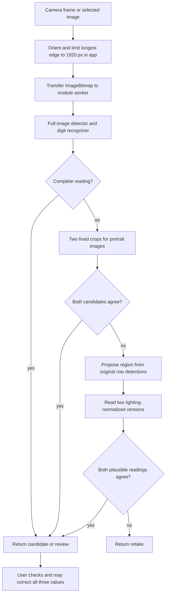

# Architecture and source map

## Runtime flow

The worker holds two ONNX Runtime sessions for its lifetime. Every inference
pass letterboxes the source to 512 square pixels, detects rows and digit boxes,
refines digit identities using DigitNet, then assembles one unambiguous vertical
stack. A reading from an earlier pass is preserved, even if its status is
`review`. Fallbacks only run when `reading` is null. At most five detector passes
are attempted: original, two central crops and two normalized row crops.

The field labels are inferred from top-to-bottom position, not from recognizing
the words SYS/DIA/PULSE. The models do not measure blood pressure. They transcribe
displayed digits. Rotated displays, different row order, single-row screens,
multiple monitors and unusual layouts are outside the current supported scope.

## Application and asset ownership

`app.mjs` owns camera permission, photo orientation, downscaling, manual crop,
UI state and verification. `inference-worker.mjs` owns model sessions and
inference. It closes each transferred bitmap after success or failure. The UI
keeps its own bitmap for redrawing and must transfer a separate copy.

The app maps `candidate` to **Check values**, `review` to **Please review**, and
`retake` to **Retake photo**. Neither of the first two statuses means the user
has verified the result. Editing any field clears the verification checkbox.
The supplied app only copies readings after the user checks that box.

Normal app images and values are held in memory. The static server has no
photo-upload endpoint. Camera tracks stop after capture, on closing the camera,
and when the page becomes hidden. Service-worker caches contain application
assets and models, not normal camera captures. The separate Android test
harness deliberately persists and submits test metrics, including expected
and predicted readings; do not confuse its behavior with the normal app.

## Source map

| Path | Responsibility |
| --- | --- |
| `prototype/web/index.html`, `styles.css` | PWA UI and layout; source/license link. |
| `prototype/web/app.mjs` | Browser photo/camera lifecycle, worker client, crop UI, verification and clipboard. |
| `prototype/web/inference-worker.mjs` | WASM sessions, detector and digit preprocessing, full fallback orchestration. |
| `prototype/web/reading.mjs` | Detector decoding, duplicate suppression and triplet assembly. |
| `prototype/web/crop-fallback.mjs` | Fixed portrait crop geometry, two-candidate agreement and coordinate translation. |
| `prototype/web/adaptive-crop.mjs` | Row-region proposal, illumination normalization and agreement with review preservation. |
| `prototype/web/*.test.mjs` | Synthetic tests for assembly and fallback rules. |
| `prototype/web/models/` | Two bundled exports, runtime config and checksum manifest. |
| `prototype/web/sw.js` | Cache-first static app/model service worker; deletes older `hearth-bp-` caches. |
| `prototype/web/manifest.webmanifest`, `icon*` | Install metadata and generated icons. |
| `prototype/tools/vendor.mjs` | Copies pinned ONNX Runtime files and license notices from npm dependencies. |
| `prototype/tools/icons.py` | Generates PWA icons; not part of inference. |
| `prototype/serve.py` | Loopback-only static server, default port 8765. |
| `prototype/detector.py` | Python ONNX CPU sessions, letterboxing, decoding and optional digit refinement; one image pass. |
| `prototype/digit_model.py` | DigitNet architecture and Python crop normalization. Importing it also imports PyTorch. |
| `prototype/reading.py` | Python triplet assembly and duplicate suppression; reference for JS logic. |
| `prototype/adaptive.py` | Python row-region and normalization reference, with adaptive fallback; not the complete browser pipeline. |
| `prototype/bootstrap.py` | Downloads official starting YOLO weights/font for training. |
| `prototype/prepare_data.py` | Builds source-preserving training/validation manifests and YOLO YAML. |
| `prototype/train_detector.py` | CPU transfer learning, augmentation, checkpoint selection. |
| `prototype/train_digits.py` | Digit/background crops, augmentation, weighted sampling, training and ONNX export. |
| `prototype/export_model.py` | Exports detector checkpoint and writes baseline browser config; does not itself run parity checks. |
| `prototype/calibrate.py` | Validation threshold search and optional release/config freeze; see caveat in development guide. |
| `prototype/verify_export.py` | Compares local PyTorch checkpoints and ONNX outputs on validation inputs. |
| `prototype/evaluate.py` | Single-pass model evaluation, per-image records and aggregate metrics. |
| `prototype/evaluate_crop_fallback.py` | Historical two-central-crop experiment; not the full adaptive2 evaluator. |
| `prototype/check_views.py` | Development experiment with image scale/framing changes. |
| `prototype/test_reading.py` | Synthetic Python assembly tests. |
| `prototype/android_browser.mjs` | Development Chrome DevTools client: camera, capture, status and diagnostic replays. |
| `prototype/android_device.py` | Explicit-serial Android command wrapper over SSH/ADB. |
| `prototype/android_test_server.py` | Local harness server accepting test result JSON. |
| `prototype/web/android-test.*`, `android-test-sw.js` | Repeated sample timing, device capabilities, camera and offline harness. |
| `evaluation/dataset_tools.py` | Validates Roboflow class order; derives triplet reference manifests from annotations. |
| `evaluation/benchmark.py`, `test_metrics.py` | Accuracy, candidate precision/coverage, latency, Wilson intervals and synthetic tests. |
| `evaluation/audit_dataset.py` | Dataset structure and duplicate-image checks; requires local research inputs. |
| `evaluation/digit_experiment.py` | Earlier digit-feature experiment using supplied annotation boxes, not deployed OCR. |
| `evaluation/contact_sheets.py` | Local image review sheets; consumes private/curated references. |
| `download_roboflow_dataset.py` | Optional authenticated dataset downloader; not needed for inference. |
| `tools/check_public_tree.py` | Checks staged/tracked blobs for excluded paths, sensitive text and approved model hashes. |
| `skills/lenovo-android/` | Portable instructions, helper and tests for phones attached to an SSH host. |
| `examples/` | Integration samples; not automatically loaded by the PWA. |

## Python/browser differences

Python consumes OpenCV BGR arrays; the browser consumes oriented bitmaps.
Python grayscale conversion precedes digit resizing; the browser resizes in
canvas before rounded RGB-to-gray conversion. Their interpolation and rounding
can differ. Python uses CPUExecutionProvider; the browser uses WASM with one
thread. Close scores can therefore change discrete predictions. A passing Python
run is not proof of browser parity on the same photo.

`Detector.read()` does not downscale the full source to 1920, perform fixed crop
fallbacks or run adaptive normalization. `adaptive_read()` adds only the adaptive
branch and returns Python-specific `adaptive` metadata. Port the complete
pipeline and evaluate it if matching PWA behavior is a requirement.
